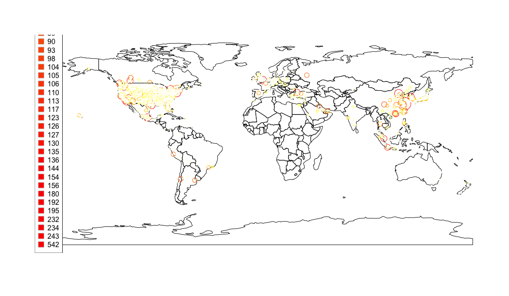
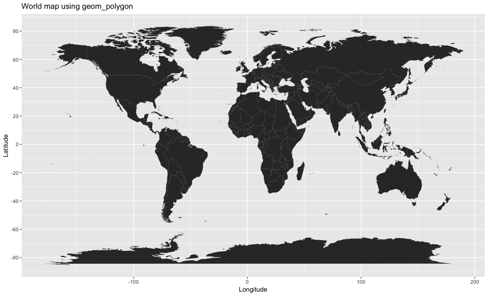
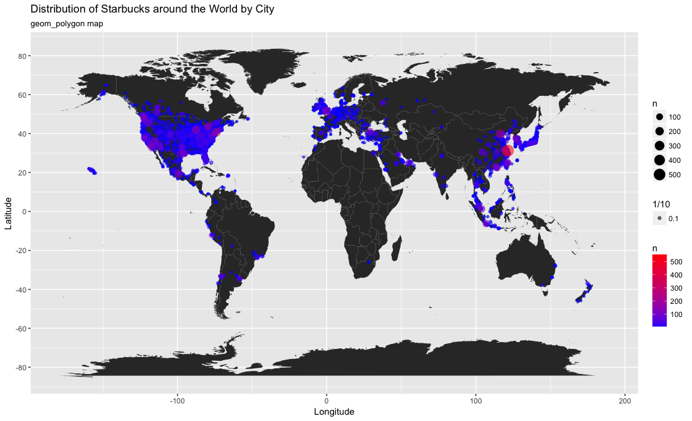
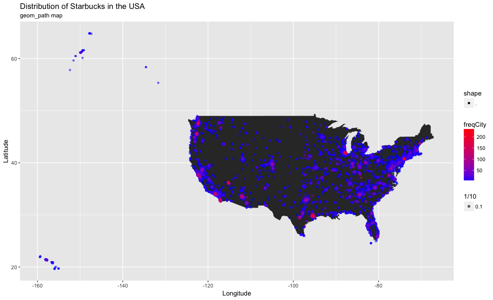
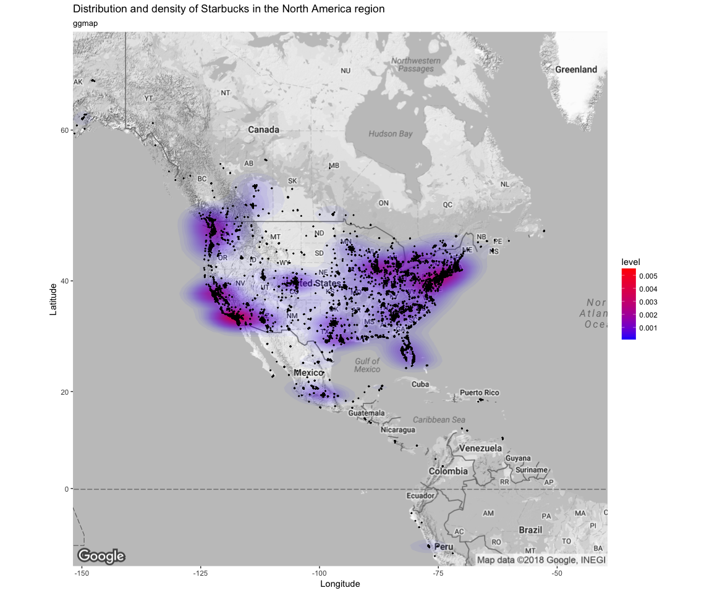
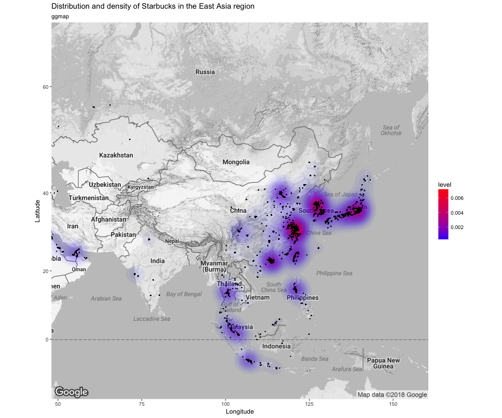

# Tidytuesday
Nouri L. BEN ZAKOUR  
9 May 2018  


```r
library(tidyverse)
```

```
## Loading tidyverse: ggplot2
## Loading tidyverse: tibble
## Loading tidyverse: tidyr
## Loading tidyverse: readr
## Loading tidyverse: purrr
## Loading tidyverse: dplyr
```

```
## Conflicts with tidy packages ----------------------------------------------
```

```
## filter(): dplyr, stats
## lag():    dplyr, stats
```

```r
library(readxl)
library(knitr)
library(skimr)
library(data.table)
```

```
## 
## Attaching package: 'data.table'
```

```
## The following objects are masked from 'package:dplyr':
## 
##     between, first, last
```

```
## The following object is masked from 'package:purrr':
## 
##     transpose
```

```r
library(janitor)

#### geolocation
library(rworldmap)
```

```
## Loading required package: sp
```

```
## ### Welcome to rworldmap ###
```

```
## For a short introduction type : 	 vignette('rworldmap')
```

```r
library(ggmap)
```

```
## Google Maps API Terms of Service: http://developers.google.com/maps/terms.
```

```
## Please cite ggmap if you use it: see citation("ggmap") for details.
```

```r
library(maps)
```

```
## 
## Attaching package: 'maps'
```

```
## The following object is masked from 'package:purrr':
## 
##     map
```

```r
library(maptools)
```

```
## Checking rgeos availability: FALSE
##  	Note: when rgeos is not available, polygon geometry 	computations in maptools depend on gpclib,
##  	which has a restricted licence. It is disabled by default;
##  	to enable gpclib, type gpclibPermit()
```

```r
library(sf)
```

```
## Linking to GEOS 3.4.2, GDAL 2.1.2, proj.4 4.9.1
```
Data prepping
=============

Possible update: could add function to load each indiv sheet


```r
# Loading data
setwd("~/REPOS/tidytuesday/data")
### data <- read_excel(file.choose(), na = "NA")
data <- read_excel("week6_coffee_chains.xlsx", na = "")
### by default loads the first sheet only
### possible update: could add function to load each indiv sheet
```

First look into the data.
Note: could clean up data but not required for next few steps.


```r
as_tibble(data)
```

```
## # A tibble: 25,600 x 13
##        Brand `Store Number`             `Store Name` `Ownership Type`
##        <chr>          <chr>                    <chr>            <chr>
##  1 Starbucks   47370-257954            Meritxell, 96         Licensed
##  2 Starbucks   22331-212325         Ajman Drive Thru         Licensed
##  3 Starbucks   47089-256771                Dana Mall         Licensed
##  4 Starbucks   22126-218024               Twofour 54         Licensed
##  5 Starbucks   17127-178586             Al Ain Tower         Licensed
##  6 Starbucks   17688-182164 Dalma Mall, Ground Floor         Licensed
##  7 Starbucks   18182-182165      Dalma Mall, Level 1         Licensed
##  8 Starbucks   23359-229184       Debenhams Yas Mall         Licensed
##  9 Starbucks    30781-99022         Khalidiya Street         Licensed
## 10 Starbucks   20423-205465        Eastern Mangroves         Licensed
## # ... with 25,590 more rows, and 9 more variables: `Street Address` <chr>,
## #   City <chr>, `State/Province` <chr>, Country <chr>, Postcode <chr>,
## #   `Phone Number` <chr>, Timezone <chr>, Longitude <dbl>, Latitude <dbl>
```

```r
skim(data)
```

```
## Numeric Variables
## # A tibble: 2 x 13
##         var    type missing complete     n      mean       sd     min
##       <chr>   <chr>   <dbl>    <dbl> <dbl>     <dbl>    <dbl>   <dbl>
## 1  Latitude numeric       1    25599 25600  34.79302 13.34233  -46.41
## 2 Longitude numeric       1    25599 25600 -27.87223 96.84405 -159.46
## # ... with 5 more variables: `25% quantile` <dbl>, median <dbl>, `75%
## #   quantile` <dbl>, max <dbl>, hist <chr>
## 
## Character Variables
## # A tibble: 11 x 9
##               var      type complete missing empty     n   min   max
##  *          <chr>     <chr>    <dbl>   <dbl> <dbl> <dbl> <dbl> <dbl>
##  1          Brand character    25600       0     0 25600     7    21
##  2           City character    25586      14     0 25600     2    29
##  3        Country character    25600       0     0 25600     2     2
##  4 Ownership Type character    25600       0     0 25600     8    13
##  5   Phone Number character    18739    6861     0 25600     1    18
##  6       Postcode character    24079    1521     0 25600     1     9
##  7 State/Province character    25600       0     0 25600     1     3
##  8     Store Name character    25600       0     0 25600     2    60
##  9   Store Number character    25600       0     0 25600     5    12
## 10 Street Address character    25598       2     0 25600     1   234
## 11       Timezone character    25600       0     0 25600    18    30
## # ... with 1 more variables: n_unique <dbl>
```

Add 2 columns giving City and Country frequency for each entry.


```r
### add 2 columns giving City and Country frequency for each entry
dt = data.table(data)
dt[, `freqCity` := .N, by = City]
```

```
##            Brand Store Number       Store Name Ownership Type
##     1: Starbucks 47370-257954    Meritxell, 96       Licensed
##     2: Starbucks 22331-212325 Ajman Drive Thru       Licensed
##     3: Starbucks 47089-256771        Dana Mall       Licensed
##     4: Starbucks 22126-218024       Twofour 54       Licensed
##     5: Starbucks 17127-178586     Al Ain Tower       Licensed
##    ---                                                       
## 25596: Starbucks 21401-212072              Rex       Licensed
## 25597: Starbucks 24010-226985         Panorama       Licensed
## 25598: Starbucks 47608-253804    Rosebank Mall       Licensed
## 25599: Starbucks 47640-253809     Menlyn Maine       Licensed
## 25600: Starbucks 47609-253286   Mall of Africa       Licensed
##                                                                       Street Address
##     1:                                                             Av. Meritxell, 96
##     2:                                                          1 Street 69, Al Jarf
##     3:                                                  Sheikh Khalifa Bin Zayed St.
##     4:                                                               Al Salam Street
##     5:                                               Khaldiya Area, Abu Dhabi Island
##    ---                                                                              
## 25596: 141 Nguyá»…n Huệ, Quận 1, Góc Ä‘Æ°á»\u009dng Pasteur và Lê Thánh Tôn
## 25597:                     SN-44, Tòa Nhà Panorama, 208 Trần Văn Trà, Quận 7
## 25598:                                     Cnr Tyrwhitt and Cradock Avenue, Rosebank
## 25599:                        Shop 61B, Central Square, Cnr Aramist & Corobay Avenue
## 25600:                                        Shop 2077, Upper Level, Waterfall City
##                               City State/Province Country Postcode
##     1:            Andorra la Vella              7      AD    AD500
##     2:                       Ajman             AJ      AE       NA
##     3:                       Ajman             AJ      AE       NA
##     4:                   Abu Dhabi             AZ      AE       NA
##     5:                   Abu Dhabi             AZ      AE       NA
##    ---                                                            
## 25596: Thành Phố Hồ Chí Minh             SG      VN    70000
## 25597: Thành Phố Hồ Chí Minh             SG      VN    70000
## 25598:                Johannesburg             GT      ZA     2194
## 25599:                      Menlyn             GT      ZA      181
## 25600:                     Midrand             GT      ZA     1682
##        Phone Number                       Timezone Longitude Latitude
##     1:    376818720        GMT+1:00 Europe/Andorra      1.53    42.51
##     2:           NA           GMT+04:00 Asia/Dubai     55.47    25.42
##     3:           NA           GMT+04:00 Asia/Dubai     55.47    25.39
##     4:           NA           GMT+04:00 Asia/Dubai     54.38    24.48
##     5:           NA           GMT+04:00 Asia/Dubai     54.54    24.51
##    ---                                                               
## 25596: 08 3824 4668         GMT+000000 Asia/Saigon    106.70    10.78
## 25597: 08 5413 8292         GMT+000000 Asia/Saigon    106.71    10.72
## 25598:  27873500159 GMT+000000 Africa/Johannesburg     28.04   -26.15
## 25599:           NA GMT+000000 Africa/Johannesburg     28.28   -25.79
## 25600:  27873500215 GMT+000000 Africa/Johannesburg     28.11   -26.02
##        freqCity
##     1:        1
##     2:        2
##     3:        2
##     4:       43
##     5:       43
##    ---         
## 25596:       17
## 25597:       17
## 25598:        1
## 25599:        1
## 25600:        1
```

```r
dt[, `freqCountry` := .N, by = Country]   ## not used further so far
```

```
##            Brand Store Number       Store Name Ownership Type
##     1: Starbucks 47370-257954    Meritxell, 96       Licensed
##     2: Starbucks 22331-212325 Ajman Drive Thru       Licensed
##     3: Starbucks 47089-256771        Dana Mall       Licensed
##     4: Starbucks 22126-218024       Twofour 54       Licensed
##     5: Starbucks 17127-178586     Al Ain Tower       Licensed
##    ---                                                       
## 25596: Starbucks 21401-212072              Rex       Licensed
## 25597: Starbucks 24010-226985         Panorama       Licensed
## 25598: Starbucks 47608-253804    Rosebank Mall       Licensed
## 25599: Starbucks 47640-253809     Menlyn Maine       Licensed
## 25600: Starbucks 47609-253286   Mall of Africa       Licensed
##                                                                       Street Address
##     1:                                                             Av. Meritxell, 96
##     2:                                                          1 Street 69, Al Jarf
##     3:                                                  Sheikh Khalifa Bin Zayed St.
##     4:                                                               Al Salam Street
##     5:                                               Khaldiya Area, Abu Dhabi Island
##    ---                                                                              
## 25596: 141 Nguyá»…n Huệ, Quận 1, Góc Ä‘Æ°á»\u009dng Pasteur và Lê Thánh Tôn
## 25597:                     SN-44, Tòa Nhà Panorama, 208 Trần Văn Trà, Quận 7
## 25598:                                     Cnr Tyrwhitt and Cradock Avenue, Rosebank
## 25599:                        Shop 61B, Central Square, Cnr Aramist & Corobay Avenue
## 25600:                                        Shop 2077, Upper Level, Waterfall City
##                               City State/Province Country Postcode
##     1:            Andorra la Vella              7      AD    AD500
##     2:                       Ajman             AJ      AE       NA
##     3:                       Ajman             AJ      AE       NA
##     4:                   Abu Dhabi             AZ      AE       NA
##     5:                   Abu Dhabi             AZ      AE       NA
##    ---                                                            
## 25596: Thành Phố Hồ Chí Minh             SG      VN    70000
## 25597: Thành Phố Hồ Chí Minh             SG      VN    70000
## 25598:                Johannesburg             GT      ZA     2194
## 25599:                      Menlyn             GT      ZA      181
## 25600:                     Midrand             GT      ZA     1682
##        Phone Number                       Timezone Longitude Latitude
##     1:    376818720        GMT+1:00 Europe/Andorra      1.53    42.51
##     2:           NA           GMT+04:00 Asia/Dubai     55.47    25.42
##     3:           NA           GMT+04:00 Asia/Dubai     55.47    25.39
##     4:           NA           GMT+04:00 Asia/Dubai     54.38    24.48
##     5:           NA           GMT+04:00 Asia/Dubai     54.54    24.51
##    ---                                                               
## 25596: 08 3824 4668         GMT+000000 Asia/Saigon    106.70    10.78
## 25597: 08 5413 8292         GMT+000000 Asia/Saigon    106.71    10.72
## 25598:  27873500159 GMT+000000 Africa/Johannesburg     28.04   -26.15
## 25599:           NA GMT+000000 Africa/Johannesburg     28.28   -25.79
## 25600:  27873500215 GMT+000000 Africa/Johannesburg     28.11   -26.02
##        freqCity freqCountry
##     1:        1           1
##     2:        2         144
##     3:        2         144
##     4:       43         144
##     5:       43         144
##    ---                     
## 25596:       17          25
## 25597:       17          25
## 25598:        1           3
## 25599:        1           3
## 25600:        1           3
```


Mapping
=======

Testing rworldmap for all Starbucks locations.
---------------------------------------------


```r
### testing rworldmap
newmap <- getMap(resolution = "high")
plot(newmap)
points(data$Longitude, dt$Latitude, col = "red", cex = .1)
```

<!-- -->

Adding bubbles colored by count of Starbucks per city. 
------------------------------------------------------

**Possible update: average the longitudes and latitudes for all Starbucks in each city to have only one bubble per city sized by count.**


```r
### testing rworldmap and bubbles
newmap <- getMap(resolution = "li")
plot(newmap)
points(dt$Longitude, dt$Latitude, col = "grey", cex = .1)

mapBubbles(dt, nameX='Longitude', nameY='Latitude', nameZSize='freqCity', nameZColour='freqCity', fill=FALSE, addLegend=FALSE, add=TRUE)
```

```
## Warning in if (class(dF) == "SpatialPolygonsDataFrame") {: the condition
## has length > 1 and only the first element will be used
```

```
## Warning in mapBubbles(dt, nameX = "Longitude", nameY = "Latitude",
## nameZSize = "freqCity", : with catMethod='categorical' you have > 15
## categories, you may want to try a different catMethod, e.g. quantile
```

<!-- -->

```r
### issues
```

Testing map_data function in ggplot2
------------------------------------


```r
## testing different maps style
world_map <- map_data("world")
p1 <- ggplot() + 
  geom_polygon(data=world_map,aes(x=long, y=lat,group=group)) +
  scale_y_continuous(breaks=seq(-80,80,by=20))
p1
```

<!-- -->

```r
p2 <- ggplot(world_map, aes(x=long, y=lat, group=group)) +
  geom_path() +
  scale_y_continuous(breaks=(-2:2) * 30) +
  scale_x_continuous(breaks=(-4:4) * 45)
p2
```

<!-- -->


```r
# reorder to overlay highest freqCity last
# dtsort <- dt[with(dt, order(freqCity)),]
dtsort <- dt %>% 
  arrange(freqCity)

p1 <- ggplot() + geom_polygon(data=world_map,aes(x=long, y=lat,group=group)) + scale_y_continuous(breaks=seq(-80,80,by=20)) + geom_point(data = dtsort, aes(x = Longitude, y = Latitude, colour = freqCity, alpha = 1/10)) + scale_colour_gradient(low="blue", high="red")
p1
```

```
## Warning: Removed 1 rows containing missing values (geom_point).
```

<!-- -->

```r
## filter usa data only
usa <- dtsort %>%
  filter(Country == "US" | Country == "USA")

p2 <- ggplot() + geom_polygon(data=world_map,aes(x=long, y=lat,group=group)) + scale_y_continuous(breaks=seq(-80,80,by=20)) + geom_point(data = usa, aes(x = Longitude, y = Latitude, colour = freqCity, alpha = 1/10)) + scale_colour_gradient(low="blue", high="red")
p2
```

<!-- -->

```r
## usa map only
p3 <- ggplot() + geom_polygon(data=map_data("usa"),aes(x=long, y=lat,group=group)) + scale_y_continuous(breaks=seq(-80,80,by=20)) + geom_point(data = usa, aes(x = Longitude, y = Latitude, colour = freqCity, alpha = 1/10, shape = ".")) + scale_colour_gradient(low="blue", high="red")
p3
```

<!-- -->


Testing ggmap
-------------

In progress: issues displaying toner type maps. Can't control display zone very well. Can't reduce point size further.

**ggmap sometimes returns an error when retrieving maps about query limit. Not reproducible**


```r
al1 = get_map(location = 'Europe', zoom = 2, color="color", maptype = "terrain")
```

```
## Source : https://maps.googleapis.com/maps/api/staticmap?center=Europe&zoom=2&size=640x640&scale=2&maptype=terrain&language=en-EN
```

```
## Source : https://maps.googleapis.com/maps/api/geocode/json?address=Europe
```

```r
p1 <- ggmap(al1) + 
  geom_point(data = dtsort, aes(x = Longitude, y = Latitude, colour = freqCity)) + 
  scale_colour_gradient(low="blue", high="red")
p1
```

```
## Warning: Removed 8963 rows containing missing values (geom_point).
```

<!-- -->

Testing density overlay with ggmap (USA focused)
------------------------------------------------

Note: inspired by Freakonomics code.


```r
al2 = get_map(location = 'USA', zoom = 4, color="bw", maptype = "terrain")
```

```
## Source : https://maps.googleapis.com/maps/api/staticmap?center=USA&zoom=4&size=640x640&scale=2&maptype=terrain&language=en-EN
```

```
## Source : https://maps.googleapis.com/maps/api/geocode/json?address=USA
```

```r
overlay <- stat_density2d(data = dtsort, aes(x = Longitude, y = Latitude, fill = ..level.., alpha = ..level..), contour = T, geom = "polygon", alpha = 0.3)
points <- geom_point(data = dtsort, aes(x = Longitude, y = Latitude), size = 0.3) 

densi <- ggmap(al2) + 
  points +
  overlay + 
  scale_fill_gradient(low="blue", high="red")
densi
```

```
## Warning: Removed 10153 rows containing non-finite values (stat_density2d).
```

```
## Warning: Removed 10153 rows containing missing values (geom_point).
```

<!-- -->

Testing density overlay with ggmap (China focused)
--------------------------------------------------


```r
al3 = get_map(location = 'China', zoom = 3, color="bw", maptype = "terrain")
```

```
## Source : https://maps.googleapis.com/maps/api/staticmap?center=China&zoom=3&size=640x640&scale=2&maptype=terrain&language=en-EN
```

```
## Source : https://maps.googleapis.com/maps/api/geocode/json?address=China
```

```r
overlay <- stat_density2d(data = dtsort, aes(x = Longitude, y = Latitude, fill = ..level.., alpha = ..level..), contour = T, geom = "polygon", alpha = 0.3)
points <- geom_point(data = dtsort, aes(x = Longitude, y = Latitude), size = 0.3) 

densi <- ggmap(al3) + 
  points +
  overlay + 
  scale_fill_gradient(low="blue", high="red")
densi
```

```
## Warning: Removed 18626 rows containing non-finite values (stat_density2d).
```

```
## Warning: Removed 18626 rows containing missing values (geom_point).
```

<!-- -->

Conclusions
===========

Further potential update
------------------------

* testing Choroplethr to color countries by count/frequencies, etc.
* tidying graphs (add legends, colors etc.)
* streamline data acquisition (other sheets containing info on other brands)

Testing sourcing other data
---------------------------

* population density (interesting contrast USA/China/Europe)
* climate data in the USA (when corrected for population density do we see more coffee places in cold places?)
* can we predict where the next Starbuck should be built?


