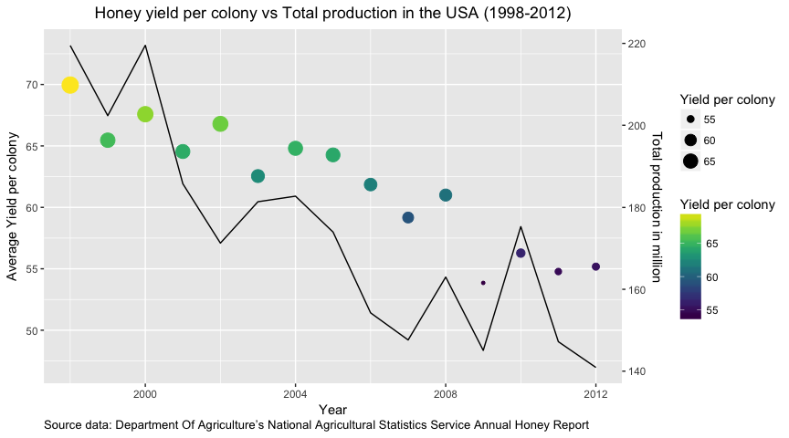
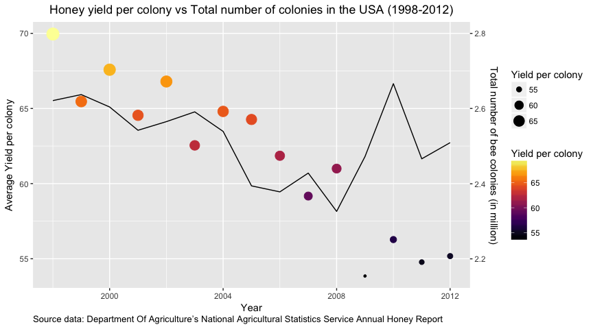

    library(tidyverse)

    ## Loading tidyverse: ggplot2
    ## Loading tidyverse: tibble
    ## Loading tidyverse: tidyr
    ## Loading tidyverse: readr
    ## Loading tidyverse: purrr
    ## Loading tidyverse: dplyr

    ## Conflicts with tidy packages ----------------------------------------------

    ## filter(): dplyr, stats
    ## lag():    dplyr, stats

    library(knitr)
    library(skimr)
    library(data.table)

    ## 
    ## Attaching package: 'data.table'

    ## The following objects are masked from 'package:dplyr':
    ## 
    ##     between, first, last

    ## The following object is masked from 'package:purrr':
    ## 
    ##     transpose

    library(viridis)

    #### geolocation 
    library(ggmap)

    ## Google Maps API Terms of Service: http://developers.google.com/maps/terms.

    ## Please cite ggmap if you use it: see citation("ggmap") for details.

    library(choroplethr)

    ## Loading required package: acs

    ## Loading required package: stringr

    ## Loading required package: XML

    ## 
    ## Attaching package: 'acs'

    ## The following object is masked from 'package:dplyr':
    ## 
    ##     combine

    ## The following object is masked from 'package:base':
    ## 
    ##     apply

Loading cleaned data
--------------------

For this challenge, I had little and decided to go with the cleaned
data.

    # Loading data
    setwd("~/REPOS/tidytuesday/scripts")
    ### data <- read_excel(file.choose(), na = "NA")
    data <- read_csv("../data/honeyproduction.csv", na = "")

    ## Parsed with column specification:
    ## cols(
    ##   state = col_character(),
    ##   numcol = col_double(),
    ##   yieldpercol = col_integer(),
    ##   totalprod = col_double(),
    ##   stocks = col_double(),
    ##   priceperlb = col_double(),
    ##   prodvalue = col_double(),
    ##   year = col_integer()
    ## )

    head(data)

    ## # A tibble: 6 x 8
    ##   state numcol yieldpercol totalprod   stocks priceperlb prodvalue  year
    ##   <chr>  <dbl>       <int>     <dbl>    <dbl>      <dbl>     <dbl> <int>
    ## 1    AL  16000          71   1136000   159000       0.72    818000  1998
    ## 2    AZ  55000          60   3300000  1485000       0.64   2112000  1998
    ## 3    AR  53000          65   3445000  1688000       0.59   2033000  1998
    ## 4    CA 450000          83  37350000 12326000       0.62  23157000  1998
    ## 5    CO  27000          72   1944000  1594000       0.70   1361000  1998
    ## 6    FL 230000          98  22540000  4508000       0.64  14426000  1998

    skim(data)

    ## Numeric Variables
    ## # A tibble: 7 x 13
    ##           var    type missing complete     n         mean           sd
    ##         <chr>   <chr>   <dbl>    <dbl> <dbl>        <dbl>        <dbl>
    ## 1      numcol numeric       0      626   626 6.028435e+04 9.107709e+04
    ## 2  priceperlb numeric       0      626   626 1.409569e+00 6.385989e-01
    ## 3   prodvalue numeric       0      626   626 4.715741e+06 7.976110e+06
    ## 4      stocks numeric       0      626   626 1.318859e+06 2.272964e+06
    ## 5   totalprod numeric       0      626   626 4.169086e+06 6.883847e+06
    ## 6        year integer       0      626   626 2.004864e+03 4.317306e+00
    ## 7 yieldpercol integer       0      626   626 6.200958e+01 1.945875e+01
    ## # ... with 6 more variables: min <dbl>, `25% quantile` <dbl>,
    ## #   median <dbl>, `75% quantile` <dbl>, max <dbl>, hist <chr>
    ## 
    ## Character Variables
    ## # A tibble: 1 x 9
    ##     var      type complete missing empty     n   min   max n_unique
    ## * <chr>     <chr>    <dbl>   <dbl> <dbl> <dbl> <dbl> <dbl>    <dbl>
    ## 1 state character      626       0     0   626     2     2       44

Honey production trends
-----------------------

Among all tables from the original article, I was interested in seeing
the evolution of honey production over time.

    by_year <- data %>%
      group_by(year) %>%
      summarise(
        tot_totalprod = sum(totalprod),      # annual total honey production
        avg_yieldpercol = mean(yieldpercol), # annual average yield per colony
        tot_numcol = sum(numcol)
      )
    by_year

    ## # A tibble: 15 x 4
    ##     year tot_totalprod avg_yieldpercol tot_numcol
    ##    <int>         <dbl>           <dbl>      <dbl>
    ##  1  1998     219519000        69.95349    2621000
    ##  2  1999     202387000        65.46512    2637000
    ##  3  2000     219558000        67.58140    2604000
    ##  4  2001     185748000        64.54545    2542000
    ##  5  2002     171265000        66.79545    2565000
    ##  6  2003     181372000        62.54545    2591000
    ##  7  2004     182729000        64.80488    2539000
    ##  8  2005     173969000        64.26829    2394000
    ##  9  2006     154238000        61.85366    2378000
    ## 10  2007     147621000        59.17073    2428000
    ## 11  2008     162972000        61.00000    2326000
    ## 12  2009     145068000        53.85000    2472000
    ## 13  2010     175294000        56.27500    2666000
    ## 14  2011     147201000        54.77500    2466000
    ## 15  2012     140907000        55.17500    2509000

    ggplot(data=by_year) +
      geom_point(aes(x = year, y = avg_yieldpercol, size = avg_yieldpercol, colour = avg_yieldpercol), show.legend = TRUE, shape = 19) + # plotting yield data as points
      labs(size="Yield per colony", colour="Yield per colony", caption = "Source data: Department Of Agriculture’s National Agricultural Statistics Service Annual Honey Report") + 
      geom_line(aes(x = year, y = tot_totalprod/3000000)) + # plotting production data as a straight line, transformed to match the range of the first y-axis
      scale_y_continuous(sec.axis = sec_axis(~.*3, name = "Total production in million")) + # add second y-axis and revert the above transformation
      scale_color_viridis(option = "viridis") + # colour with viridis palette 
      ggtitle("Honey yield per colony vs Total production in the USA (1998-2012)") +
      theme(plot.title = element_text(hjust = 0.5), plot.caption = element_text(hjust = 0)) +
      xlab("Year") +
      ylab("Average Yield per colony")

Total production and yield do decrease over the years but what I did
find interesting was 2009 with particularly low production. Could this
be in any way related to GFC?

On a technical side, plotting a second y-axis turned out not to be that
straight forward in ggplot2! To do so here, as the second dataset is in
a different range, \[50-80\] vs millions, I had to transform the values
of total production to match the range of honey yield.

    ggplot(data=by_year) +
      geom_point(aes(x = year, y = avg_yieldpercol, size = avg_yieldpercol, colour = avg_yieldpercol), show.legend = TRUE, shape = 19) +
      labs(size="Yield per colony", colour="Yield per colony", caption = "Source data: Department Of Agriculture’s National Agricultural Statistics Service Annual Honey Report") +
      geom_line(aes(x = year, y = tot_numcol/40000)) + # plotting colony data as a straight line, transformed to match the range of the first y-axis
      scale_y_continuous(sec.axis = sec_axis(~.*0.04, name = "Total number of bee colonies (in million)")) + # add second y-axis and revert the above transformation
      scale_color_viridis(option = "inferno") +
      ggtitle("Honey yield per colony vs Total number of colonies in the USA (1998-2012)") +
      theme(plot.title = element_text(hjust = 0.5), plot.caption = element_text(hjust = 0)) +
      xlab("Year") +
      ylab("Average Yield per colony")

While honey production and yield per colonies did go down in the first
graph, here the number of total colonies remain quite stable, in
particular from 2009 (with the max recorded for 2010). What this data is
missing is the size of colonies. Are they smaller nowadays? Or are they
simply not as much productive as they used to?

Conclusion
----------

I didn't do much more on this challenge as I went on bit of a tangent. I
was really interested in finding evidence that a reduction of habitat
could be associated with the reduction of honey production. I spent a
lot of time looking for historical satellite images or vegetation maps
onto which I could visualise the difference in yield over time. While
there are a lot of resources for this, I could not find any readily
available in an R package like ggmap or similar. I'll keep an eye for
alternatives although this goes a bit beyond the scope of this exercise.
